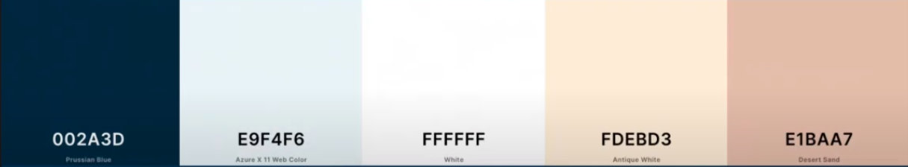

# PROJET CLIENT - Easy Spacy

> [EasySpacy sur Instagram](https://www.instagram.com/easyspacy/)

> [Lien de mon Moodboard sur Milanote](https://app.milanote.com/1Lfo791VkWHGbQ?p=xDNRXlUyrhc)

> [Wireframe Prototype Figma](https://www.figma.com/proto/efLBUsdbNGzrA3uNj87OsQ/Maide---EasySpacy---Wireframe?node-id=122%3A207&scaling=min-zoom)

***

## 1. Présentation

Sarah JOIRET (astrophysicienne) et Léo COTTELEER (ingénieur aérospatiale) ont créé un compte à deux, sur instagram appelé "**EasySpacy**" qui a pour but de de  faire de la communication sur des aspects scientifiques liés à l'**aérospaciale** et l'**astrophysique**. Il s'agit de vulgarisation scientifique.

L'objectif est de partager des **informations scientifiques vérifiées** de manière à ce que tout le monde puisse les comprendre.

Les posts se présentent sous forme de petites **capsules** qui comprend 7 à 8 slides, où les informations sont ludiques, accrocheuses, simples à comprendre, facile et rapide à lire.

Dans ces posts, on retrouve des images, photos, illustrations et vidéos.

***

## 2. Public cible

- Tout public (assez large)
- Tous ceux/celles qui n'ont pas instagram
- Personnes âgées

- L'approche principale se fera donc en version pour ordinateur puis l'adaptation du site pour les téléphones en second (le développement se fera en Mobile First)

***

## 3. Cahier des charges

1. Base
    - Site simple (pas trop de couleur, ni de fonctionnalités, etc)
    - Site intuitif (facile à utiliser, ergonomique, efficace et efficient)
    - Faire intervenir les "avatars"
    - garder la palette de couleur suggérée (ou ne pas trop dériver)
    - Choisir des polices sobres et bien tracés (open sans) pas trop extravagantes
    - Site en blanc
    - Les capsules seront des versions longues des posts instagram

2. Fonctionnalités
    - Barre de recherche
    - Site web RESPONSIVE
    - Logo responsive (possibilité de n'affiche que la fusée)
    - Dynamique (mouse Hover)
    - Formulaire de contact (avec option : message, avis, question, suggestion, thème à proposer etc)
    - La gestion du site se fera par la suite via le [CMS WordPress](https://harsene.com/cest-quoi-wordpress/)

4.  Pages
    - Capsule (Accueil)
        - Bannière accrocheuse avec les avatars
        - Listes des capsules
    - Page d'une capsule (article)
        - Images + description
        - Lien vers le ; post de IG de la capsule
    - News (actualités)
        - Actualité d'EasySpacy
        - concours et prix vulgarisation scientifique
        - style blog
    - À propos de (about us)
        - présentation brève (pas trop long)
    - Contact
        - formulaire de contact
        - adresse mail
    - Pied de page
        - lien journaliste : relayer information

5. Couleurs

  

***

## 4. Plan du site

1. **Accueil**

  - _Section 1 - Menu (commune à toutes les pages)_
    - Logo easyspacy (gauche)
    - Barre de menu pour pouvoir naviguer entre les différentes pages (capsules, news, à propos, contact) (milieu)
    - Bouton de recherche (droite)
    - Logo instagram (droite)
  - _Section 2 - En tête de la page d'accueil_
    - Sera composée d'une grande bannière
    - phrase intro du site (présentation très très coute)
    - lien `"en savoir plus"` qui renvoi vers la page "à propos"
  - _Section 3 - Contenu : Capsules_
    - Listes des capsules (images en formats carrés)
    - ± 20 Capsules seront affichés
    - Un bouton `"afficher plus"` afin d'en afficher plus de capsules et donc chargera 20 autres capsules
    - tout en haut de cette liste de capsule se trouveront des "tags" qui permettront de trier les capsules en fonction de ce qui sera sectionné : `Tout, Aérospaciale, Astrophysique, Autres`
    - au clique sur une capsule, on sera redirigé vers la page de la capsule sur laquelle on aura cliqué
  - _Section 4 - avant le pied de page suggérer de voir des news_
    - titre
    - sous-titre
    - bouton pour voir les news
    - La dernière news
  - _Section 5 - Pied de page_
    - Lister les pages du site
    - Mettre le Logo instagram afin de rediriger vers EasySpacy IG
    - adresse mail
    - lien pour presse & média qui redirige vers la page presse-média qui informera les journalistes de comment relayer les informations

2. **Page d'une capsule**

    - Slider avec les images de leurs posts IG
    - Texte descriptif de ce qui est marqué sur les images avec des informations complémentaires voir additionnelles
    - section "commentaires"
    - avant le pied de page ajouter une section pour rediriger vers les 3 ou 4 derniers articles (capsules) suivi d'un lien (bouton) `"Voir toutes les capsules"`

4. **Page News**

    - Trier par ordre décroissant
    - mettre l'image de l'article avec un titre
    - suivi d'une phrase catch de l'article
    - bouton "lire plus" qui redirigera vers la news
    - ± 24 news seront listés , pour voir la suite je propose une "pagination" à la fin de la section (`Page préc. | 1, 2, 3 | Page Suiv.`)
    - Mettre les "revues de presses" dans cette page

5. **Page d'une seule News**

    - Style blog
    - Une image
    - Le texte de la news
    - avant le pied de page il y aura une section avec les 3 ou 4 dernières news afin d'inciter l'utilisateur à lire plus pour qu'il n'ait pas l'impression d'être pris dans un cul-de-sac suivit d'un bouton `"voir toutes les news"`.

6. **Page À propos de nous**

    - On retrouvera les avatars ici aussi
    - une courte description de ce qu'est EasySpacy et qui dirige easy spacy
    - avant le pré - pied de page ajouter une section qui reprend les 3 ou 4 derniers capsules suivi d'un lien `"voir toutes les capsules"`

7. **Page Contactez-nous**

    - Titre de la page
    - court texte afin d'inciter l'utilisateur à nous contacter
    - faire interagir les avatars
    - Formulaire de contact
    - lien nous contacter par mail
    - lien nous contacter sur instagram

8. **Page Média et Presse**

    - Texte simple sans chi-chi (comme les Politique de confidentialité des sites web)
    - ajouter un bouton "nous contacter si ce n'est pas clair ou pour des infos additionnelles" en haut de la page

8. **Page Recherche**

    - Afficher le résultat de la Recherche
    - Nombre de résultat trouvé
    - Les résultats seront affichées en forme de liste (avec texte + description de la page)
    - A coté de ses listes ajouter un bouton pour dire "accéder à la page" ou "lire plus".

9. **Page Recherche : pas de résultat**

    - écrire une phrase typique "oops pas de résultat" et faire intervenir les avatars
    - proposer un bouton pour "voir toutes les capsules"
